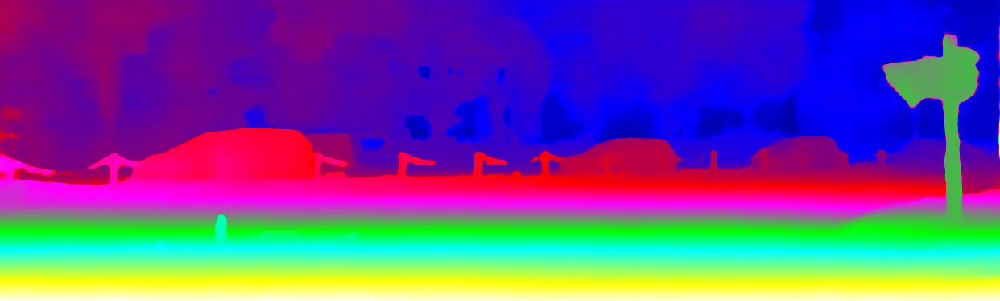

# TriStereoNet
    

This repository contains the code for "TriStereoNet: A Trinocular Framework for Multi-baseline Disparity Estimation" [[arXiv](http://arxiv.org/abs/2111.12502)]
[[project page](https://uni-tuebingen.de/fakultaeten/mathematisch-naturwissenschaftliche-fakultaet/fachbereiche/informatik/lehrstuehle/kognitive-systeme/projects/tri-camera-stereo-vision/)][[dataset](https://uni-tuebingen.de/fakultaeten/mathematisch-naturwissenschaftliche-fakultaet/fachbereiche/informatik/lehrstuehle/kognitive-systeme/projects/tri-camera-stereo-vision/)].

TriStereoNet is a multi-baseline solution for depth estimation of both short- and long-range objects. The network 
is an end-to-end model that fuses the data of narrow and wide stereo pairs. By providing improved flexibility and 
scalability in depth estimation, this multi-baseline model is promising for long-range visual perception 
and autonomous navigation, where the image content is unpredictable in terms of the distance to the camera.

Self-supervised Learning      Trinocular EISATS Dataset  |  Supervised Learning   Trinocular CARLA Dataset
:-------------------------:|:-------------------------:
    |  

|                                                             Supervised Learning   Binocular KITTI 2015 Dataset                                                             |
|:------------------------------------------------------------------------------------------------------------------------------------------------------------------------------:|
|                                       |
|                                    	  |
|                                     	 |

[//]: # (
)

[//]: # (    
 <b>Self-supervised Learning - Trinocular EISATS Dataset</b> 
)

[//]: # (    )

[//]: # (    
 <b>Supervised Learning - Trinocular CARLA Dataset</b> 
)

[//]: # (    )

[//]: # (
)

To be updated ...
